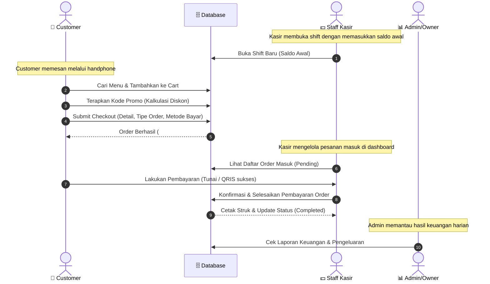

# 🏆 Pahlawan Kesorean - POS & Self-Service Ordering System

Selamat datang di panduan penggunaan dan dokumentasi alur kerja aplikasi **Pahlawan Kesorean**! Dokumen ini dirancang untuk membantu Anda memahami struktur sistem, peran pengguna (roles), alur transaksi ujung-ke-ujung (end-to-end), serta cara menjalankan dan mengembangkan proyek ini secara lokal.

---

## 📌 Daftar Isi
1. [Struktur Sistem & Peran (Roles)](#-struktur-sistem--peran-roles)
2. [Alur Kerja Transaksi (Workflows)](#%EF%B8%8F-alur-kerja-transaksi-workflows)
3. [Diagram Alur Kerja (Mermaid)](#-diagram-alur-kerja-mermaid)
4. [Panduan Instalasi & Menjalankan Project](#%EF%B8%8F-panduan-instalasi--menjalankan-project)
5. [Panduan Penggunaan Fitur Utama](#-panduan-penggunaan-fitur-utama)

---

## 👥 Struktur Sistem & Peran (Roles)

Aplikasi Pahlawan Kesorean memiliki **3 modul utama** yang disesuaikan dengan peran pengguna masing-masing:

### 1. 📱 Modul Customer (Self-Service Ordering)
Modul publik berbasis mobile-first yang dapat diakses oleh pelanggan melalui QR Code di meja makan untuk memesan secara mandiri.
* **Fitur Utama:**
  * **Landing Page:** Halaman sambutan yang estetik dengan akses langsung ke menu.
  * **Daftar Menu Dinamis:** Pencarian menu instan, filter kategori (Makanan, Minuman, Snack, Dessert), serta penambahan item langsung ke keranjang.
  * **Keranjang Belanja:** Mengatur kuantitas item, menambahkan catatan kustom per item (contoh: *"Kurang manis"*, *"Tanpa es"*), serta menerapkan kode promo untuk potongan harga.
  * **Checkout & QRIS Generator:** Mengisi informasi pemesan, memilih jenis pesanan (*Dine In* atau *Take Away*), metode pembayaran (*Cash* atau *QRIS*).
  * **QRIS Dynamic Timer:** Menampilkan QRIS otomatis dengan waktu kedaluwarsa 5 menit (dihitung mundur) beserta nomor pesanan yang siap disalin.

### 2. 💵 Modul Kasir (Point of Sale & Order Management)
Modul khusus bagi staff kasir untuk memproses transaksi offline dan mengelola pesanan masuk dari pelanggan online.
* **Fitur Utama:**
  * **Manajemen Shift:** Kasir wajib membuka shift dengan saldo modal awal sebelum melakukan transaksi, dan menutup shift di akhir hari untuk merekap pendapatan riil.
  * **Verifikasi Pesanan Online:** Memvalidasi status pesanan masuk dari pelanggan (khususnya verifikasi pembayaran QRIS dan Cash).
  * **POS Kasir Offline:** Menginput pesanan langsung untuk pelanggan walk-in.

### 3. 📊 Modul Admin & Owner (Backoffice & Report Center)
Modul dashboard pusat untuk memantau performa bisnis dan mengelola data master.
* **Fitur Utama:**
  * **Manajemen Menu & Kategori:** Menambah, mengubah, menghapus menu dan mengupload gambar produk.
  * **Manajemen Pengguna:** Mengontrol data staff kasir, admin, dan owner, serta mengaktifkan/menonaktifkan status akun.
  * **Manajemen Promo:** Membuat kode kupon diskon (tipe persentase atau potongan tetap) beserta limit masa aktif.
  * **Manajemen Pengeluaran (Expenses):** Mencatat biaya operasional harian (seperti listrik, air, bahan baku).
  * **Pusat Laporan & Analitik:** Grafik analitik pendapatan dan pengeluaran secara harian/mingguan/bulanan.
  * **Log Aktivitas:** Log sistem yang mencatat tindakan sensitif (khusus owner).

---

## ⚙️ Alur Kerja Transaksi (Workflows)

Berikut alur kerja utama dalam transaksi self-service pelanggan hingga diselesaikan oleh kasir:

1. **Pelanggan** menscan QR Code meja untuk membuka daftar menu.
2. Pelanggan memilih hidangan, mengatur kuantitas, mencantumkan catatan pesanan (jika ada), memasukkan kode promo, dan mengisi formulir checkout.
3. Setelah melakukan checkout, pesanan tersimpan di database dengan status `Pending`. 
4. Jika memilih metode **QRIS**, pelanggan diarahkan ke halaman QRIS dinamis berdurasi 5 menit. Jika memilih **Cash**, pelanggan dapat langsung mendatangi kasir.
5. **Kasir** membuka aplikasi, melihat pesanan masuk pada dashboard, memverifikasi pembayaran pelanggan, lalu memperbarui status pesanan menjadi `Completed`.
6. Staf dapur mempersiapkan pesanan, lalu menyajikannya ke meja pelanggan.

---

## 📊 Diagram Alur Kerja (Mermaid)

Berikut visualisasi teknis alur transaksi sistem Pahlawan Kesorean menggunakan Mermaid:



---

## 🛠️ Panduan Instalasi & Menjalankan Project

Ikuti langkah-langkah di bawah ini untuk menjalankan project ini di komputer lokal Anda:

### 📋 Prasyarat (Prerequisites)
Pastikan komputer Anda sudah terinstall:
- PHP >= 8.2
- Composer
- Node.js & npm (versi terbaru recommended)
- MySQL / MariaDB

### 🚀 Langkah-langkah Setup
1. **Clone & Masuk ke Folder Project:**
   ```bash
   cd pahlawan_kesorean
   ```

2. **Install Dependensi PHP & Javascript:**
   ```bash
   composer install
   ```
   ```bash
   npm install
   ```

3. **Duplikasi & Konfigurasi Environment File:**
   ```bash
   cp .env.example .env
   ```
   *Buka `.env` Anda dan sesuaikan konfigurasi database berikut:*
   ```env
   DB_CONNECTION=mysql
   DB_HOST=127.0.0.1
   DB_PORT=3306
   DB_DATABASE=pahlawan_kesorean
   DB_USERNAME=root
   DB_PASSWORD=password_kamu
   ```

4. **Generate Application Key:**
   ```bash
   php artisan key:generate
   ```

5. **Jalankan Migrasi & Database Seeder:**
   ```bash
   php artisan migrate --seed
   ```
   > [!NOTE]
   > Menjalankan database seeder akan membuat beberapa data bawaan seperti kategori, beberapa menu default, dan akun default untuk pengujian awal.

6. **Membuat Symlink ke Storage (Untuk File Upload Gambar):**
   ```bash
   php artisan storage:link
   ```

7. **Menjalankan Server Lokal:**
   Jalankan server Laravel dan bundler Vite secara bersamaan menggunakan dua terminal terpisah:
   * **Terminal 1 (Laravel Server):**
     ```bash
     php artisan serve
     ```
   * **Terminal 2 (Vite Compiler):**
     ```bash
     npm run dev
     ```

Aplikasi kini dapat diakses melalui:
* Modul Customer: [http://localhost:8000](http://localhost:8000)
* Backoffice Login: [http://localhost:8000/login](http://localhost:8000/login)

---

## 💡 Panduan Penggunaan Fitur Utama

### 1. Menguji Kode Promo
Untuk menggunakan diskon potongan saat berbelanja sebagai customer:
1. Akses halaman menu dan tambahkan beberapa item ke keranjang.
2. Pergi ke halaman **Keranjang Saya**.
3. Klik **"Punya kode promo"**, lalu masukkan kode promo aktif yang tersedia (misal: `HEMAT10`) dan klik **Gunakan**.
4. Diskon akan otomatis memotong total pembayaran Anda secara real-time.

### 2. Menguji Pembayaran QRIS Dinamis
1. Di halaman Checkout, pilih metode pembayaran **Qris**.
2. Masukkan nama Anda lalu selesaikan pesanan.
3. Anda akan diarahkan ke halaman **Sukses** yang berisi kode QRIS otomatis yang dibuat secara instan menggunakan standard CRC16.
4. Anda akan melihat **Countdown Timer 5 Menit** berjalan mundur. Jika timer habis, status pembayaran akan menjadi *Expired*.

### 3. Mengontrol Transaksi via Kasir (Pembukaan & Penutupan Shift)
1. Login sebagai Kasir (melalui `/login`).
2. Pergi ke menu **Shift**. Anda akan diminta menginput **Uang Modal Awal** sebelum bisa mengakses menu POS.
3. Setelah shift dibuka, Anda dapat melihat dan menyelesaikan pesanan masuk dari customer online, serta menginput pesanan offline.
4. Di akhir hari kerja, klik **Tutup Shift** untuk memasukkan jumlah uang riil di laci kasir dan mencetak laporan selisih keuangan (selisih uang kasir vs catatan sistem).

---

> [!TIP]
> **Mobile Layout Design:** Modul customer dirancang mobile-first dengan tampilan mockup handphone yang interaktif. Di perangkat seluler asli, tampilan ini akan otomatis melebar memenuhi layar dan mengunci scroll bar utama browser sehingga topbar dan bottom navbar terasa seperti aplikasi native yang responsif.
